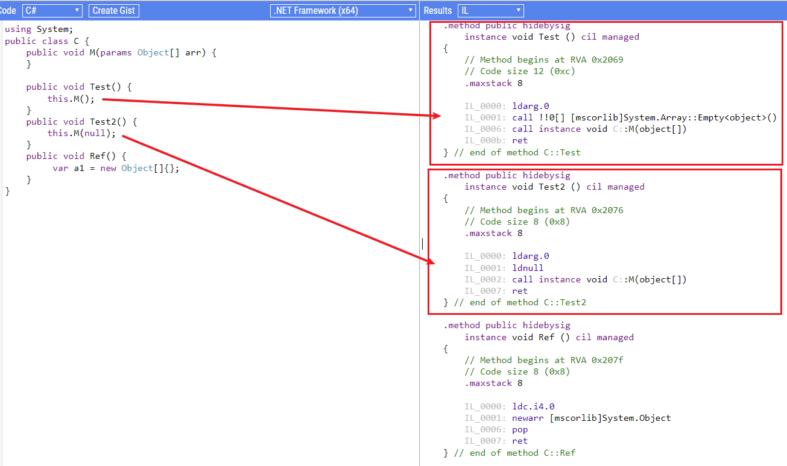

# 深入.Net GC

现在谈到GC（Garbage Collector），似乎不得不提JVM的[ZGC](https://wiki.openjdk.java.net/display/zgc/Main)。而dotNet世界里的GC（由CLR提供）则没有那么出名。这里给出两个关于CLR GC的资料：
- [Official Doc](https://docs.microsoft.com/en-us/dotnet/standard/garbage-collection/)
- [Maoni S. Personal Doc](https://github.com/Maoni0/mem-doc/blob/master/doc/.NETMemoryPerformanceAnalysis.md)

第二个资料虽然是personal doc，但因为Maoni是dotNet开发组专攻GC的一位TechLead（Partner级别），所以十分有价值。
而本文正文主要总结自Maoni在微软内部的一次分享会（在微软工作的好处是可以从大神们那里聆听到第一手经验）。

---

## 常识

GC负责分配和回收内存。

当进程启动，CLR会开辟一块连续的地址空间，叫做`managed heap`。该进程的所有线程都使用这个heap。该heap会存储下一个object应该被分配的地址。由于object是顺序排列的，所以其分配比`unmanaged code`从OS申请内存快很多，接近于stack的速度。

`unmanaged resource`指的是object中的OS资源，比如文件句柄、窗口句柄、网络连接。GC虽然能够感知到但并不知道如何清理它们。你需要把清理的方法写在 Dispose()中，然后尽量用`using()`语法自动在离开当前域后自动触发`Dispose()`。如果使用者没有使用using且忘记手动调用 Dispose()，还有两个办法：A. 把 unmanaged resource包裹在safe handle中，然后在Dispose()中调用safe handle的Dispose()。B. 重载Object.Finalize。推荐方法A。

同时CLR会维护若干个`application root`：static field，local var， thread stack，CPU register。
回收时分两步：收集和清理。收集的大致过程是：遍历`application roots`，绘制出多个graph，那些不在graph里的就是unreachable的，会被清理。清理的大致过程是：GC将unreachable object之后的其他object拷贝到新位置，并更新指针，这叫做 `memory compaction`。
回收时，所有线程暂停，这叫做`STW`(Stop the world)。

> 等一下，这就是说[dio和承太郎的能力](https://www.zhihu.com/question/348250111/answer/841026935)原来和垃圾回收是一个原理？

所有线程暂停这极大地影响程序的性能，因此各路英雄好汉都想着如何减少STW的时间。

`Generic GC`是其中之一。其有效性来自于统计学的结果：对象的生命周期两极分化，即要么活的很久要么很短。因此为了提升性能，managed heap逻辑上被分为三代：0，1，2。每次只对部分对象进行GC。🟡TODO：补充步骤

`LOH`（Large Object Heap）是另一个手段。为了提升性能，CLR把较大的object（85KB以上，通常是Array）单独放在另一个heap中，这个heap就叫做 LOH。LOH通常不会进行compaction，除非特别设置。不进行compaction的结果是，GC会把deadobject的位置标记为可用，用于下一次分配。在实践中，要避免对象被分配到LOH（大的Dictionary、List可以通过Segmentation来分割成一块块的小内存）。

还有很多方式，这里不便再展开。

🟡TODO：补充managed memory leak，及一两个错误和避免措施

## Maoni S. 的内部分享
### memory situation
- heap size: memory usage
- % time in GC: trade off between heap size and throughput. <=5% is ususally good enough.
- individual GC pauses: trade off between heap size and tail latency
	
so, what is your goal?

### measure memory
it can be very confusing: termiology is different in different tools: free, committed, reserved, virtual, physical, working set…
- `reserved`:
			you tell Virtual Memory Manager to reserve a range of address for you, and others won't use it.
			After comitted, you cannot write any time immediately, because OS has not allocated physical memory.
- `committed`:
			To let OS allocate physical memory for your data, you need commit.
			Including physical memory and PF (Page File) usage​.
- `virtual` & `physical`
			https://github.com/Maoni0/mem-doc/blob/master/doc/.NETMemoryPerformanceAnalysis.md#Virtual-memory-fundamentals

For most of time, we care about committed memory. How to get that?
- in .net framework, perf counter, "Total committed bytes".
- in .net 5, GetGCMemoryAPI, ETW events.

But how to correlate with your data size?
- we need to know how GC works.
- (total committed bytes is usually larger than actual heap size because GC will not return this space to OS. --self note)

> even if you use c++, you cannot control memory directly as long as using some memory manager. It's a mid-layer between your code as OS.

### 通过IL看某段代码是否会造成GC

创建引用类型对象、对值类型装箱，都会产生GC，有时候从C#代码上看得并不明显。除了理论分析、Profiler分析，还有个方法应当多用：分析IL代码。（[在线IL翻译工具SharpLab.io](https://sharplab.io/)）

> 某位同学说，函数使用不定参数，在调用的时候如果没有参数一定要传 `null`，否则会创建空对象，频繁调用会造成不必要的GC。真的是这样吗？利用上述工具，发现并不会。因为IL代码中实际上会用一个全局共享的Array.Empty对象当做参数传递的。经常分析IL的好处不仅于此，这里不再展开。
> 

## 更多资料
- dotNet GC 源码：https://github.com/dotnet/runtime/tree/main/src/coreclr/gc
- 《Pro .Net Memory Management》 by Konrad Kokosa： http://prodotnetmemory.com/，其自制的两幅 .Net Memory Poster 也很有价值 [PDF1](http://prodotnetmemory.com/data/netmemoryposter.pdf), [PDF2](http://prodotnetmemory.com/data/netmemoryposter_threads.pdf)