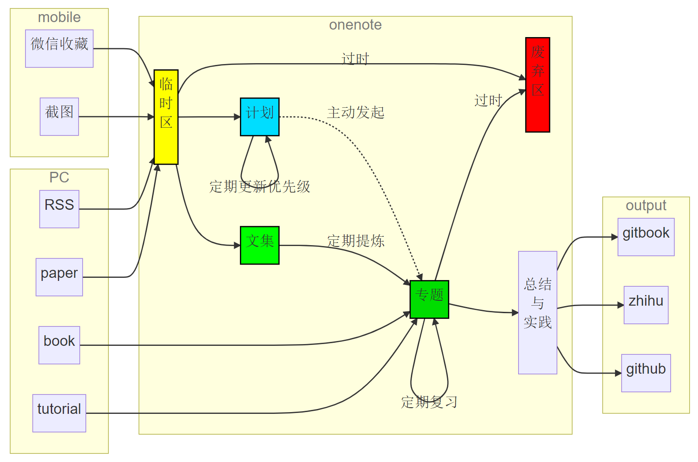

# 游戏引擎开发者的学习路线与资料

## 游戏引擎开发的路线图
关于这点知乎上的讨论已经很多，比如广为人知的`Milo Yip`提供的一份[游戏开发进阶书单](https://github.com/miloyip/game-programmer)。作为长期持续学习，上述路线图是一个不错的指南。但如果你的时间很有限，想尽快熟悉引擎开发，那么上述路线图可能不是非常适合。

## 我准备怎么学

工作并有了家庭后，学习的总时间极大地减少了，碎片时间却相应的增加了。对于没有系统学习过图形学或者没有引擎开发经验的同学来说，一定要持续思考以下问题：
- 目标是什么（短期vs长期）
- 差距在哪里（客观）
- 如何把相对完整的时间用在刀刃上（精力管理，流程固化）
- 如何识别哪些知识是刀刃（优先级）
- 如何把刀用好（总结 + 实践 + 输出）

知识沉淀流程

## 优质资料推荐

#### 书籍
- 《游戏引擎架构》，`Milo Yip` 译。后来该书又出了第二版和第三版，只有英文原著，新增内容如下。
  > - computer and CPU hardware and memory caches.
  > - compiler optimizations.
  > - C++ language standardization.
  > - the IEEE-754 floating-point representation.
  > - 2D user interfaces.
  > - an entirely new chapter on hardware parallelism and concurrent programming.
  > - Information on new topics, including the latest variant of the C++ programming language, C++11, and the architecture of the eighth generation of gaming consoles, the Xbox One and PlayStation 4.
  > - New chapter on audio technology covering the fundamentals of the physics, mathematics, and technology that go into creating an AAA game audio engine.
  > - Updated sections on multicore programming, pipelined CPU architecture and optimization, localization, pseudovectors and Grassman algebra, dual quaternions, SIMD vector math, memory alignment, and anti-aliasing.
  > - Insight into the making of Naughty Dog’s latest hit, The Last of Us.

- 《Real-Time Rendering 4th》(RTR4)，[官网](http://www.realtimerendering.com/)，知乎上有牛人分享了[读书笔记](https://www.zhihu.com/column/game-programming)
- 《Physically Based Rendering 4th》(PBRT)，[官网](https://www.pbrt.org/)， 书中[源码](https://github.com/mmp/pbrt-v4)

- GPU 系列
  - 《GPU Gems》1~3（2004~2006），[电子书](https://developer.nvidia.com/gpugems/gpugems/foreword)；
  - 《GPU Pro》1~7（2010~2017）；
  - 《GPU Zen》（2017）。

- 《游戏引擎原理与实践》（卷1，卷2），`王东哲`著。

#### 业界分享
- GDC
- SIGGRAPH

#### 沧海遗珠
- `Cherno`： 
  - [Game Engine 系列视频](https://www.youtube.com/playlist?list=PLlrATfBNZ98dC-V-N3m0Go4deliWHPFwT)，
  - [OpenGL 系列视频](https://www.youtube.com/watch?v=W3gAzLwfIP0&list=PLlrATfBNZ98foTJPJ_Ev03o2oq3-GGOS2&index=1)，
  - [C++ 系列视频](https://www.youtube.com/playlist?list=PLlrATfBNZ98dudnM48yfGUldqGD0S4FFb)
- `Milo Yip`： [游戏关键技术整理](http://gamextech.org/)
- `Morgan McGuire`： [Graphic Programming Project](http://graphicscodex.com/projects/projects/)
- `Inigo Quilez`：（ShaderToy创始人之一），[图形学文集](https://www.iquilezles.org/www/index.htm)
- 知乎专栏
  - `chopper`: [chopper的图形渲染](https://www.zhihu.com/column/chopper-rendering)
  - `丛越`: [CreateX Engine](https://www.zhihu.com/column/CreateXEngine)
  - `叛逆者`：[Highway to Graphics](https://www.zhihu.com/column/highwaytographics)
  - `文刀秋二`: [Behind the Pixels](https://www.zhihu.com/column/behindthepixels)
  - `文礼`: [高品质游戏开发](https://www.zhihu.com/column/c_119702958)

#### UE4 专题
- 《大象无形·虚幻引擎程序设计浅析》
- [Unreal Engine doc](https://docs.unrealengine.com/en-US/index.html)
- [为Unity开发者准备的虚幻引擎4指南](https://docs.unrealengine.com/zh-CN/Basics/UnrealEngineForUnityDevs/index.html)
- `大钊` [Inside UE4](https://www.zhihu.com/column/insideue4)
- `Jerish` [Exploring in UE4](https://www.zhihu.com/column/c_164452593)
- [风恋残雪的游戏编程](https://www.zhihu.com/column/c_154899362)
- `quabqi` [手摇虚幻引擎](https://zhuanlan.zhihu.com/p/362377941)
#### 工具
- [OpenGL API 查询](http://docs.gl/)
- [ShaderToy](https://www.shadertoy.com/)