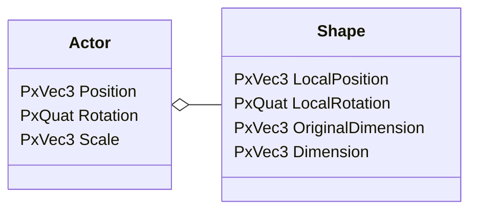

# 深入 LossyScale

本文其实要弄明白一个3D数学问题：如何处理父节点带有非均匀缩放和旋转时，子节点的最终大小和形态。问题源自笔者在修改物理引擎为其添加`scale`属性时遇到的一个bug。解决后对`WorldScale`为什么叫做`LossyScale`、空间变换和基变换有了更深的理解。

# 背景
- PhysX引擎中，场景内的Actor之间并没有父子层级关系，仅有的层级是Shape可以绑定到Actor作为子节点。
- PhysX引擎中并没有`Scale`的概念，即`PxTransform`只包含`Position`和`Rotation`，而大小只反映在最底层`Shape`的尺寸上（比如球形碰撞盒有半径这个属性）。所以设置缩放比例的实现方式是改变物体尺寸。
- Actor下可以有若干Shape，这里只讨论一个Shape。增加属性`Actor.Scale`，修改该属性时要保证`Shape.Dimension`的正确性。



```cpp
Shape.Dimension = Shape.OriginalDimension * GetShapeScale();
```
问题简化为实现`GetShapeScale()`。

当Shape相对Actor没有旋转，即`Shape.LocalRotation = (0,0,0,1)`时，容易发现：
```cpp
PxVec3 GetShapeScale() {
    return actor.Scale;
}
```

# 问题
但是当同时存在旋转和非均匀缩放呢？简单来说，当`Actor.Scale=(1,4,1)`，而Shape绕z轴转了90度，那么预期的结果应该是`(4,1,1)`，即Shape相对于自己在横向上扩大到2倍。若绕z轴转了45度，那么预期的结果是`(2,2,1)`。要如何达到这种效果呢？

# 似是而非的算法
一个很自然的想法是，要达到上面的效果，其实是将`Actor.Scale`像方向矢量那样旋转到Shape空间内。

```cpp
PxVec3 GetShapeScale() {
    PxTransform shapeSpace = shape->getLocalPose();
    return shapeSpace->rotate(actor.Scale);
}
```

然而反例是：`actorScale=(1,1,1)`经过旋转后可能不再是`(1,1,1)`，即Shape叠加了一个缩放。这是与事实违背的。针对`(1,1,1)`特殊处理也并不正确，因为对于任意`(X,Y,Z)`，总有一种旋转让其某个分量为`0`。

这种算法的错误之处在最后一节会额外讨论。

# 正确的算法

在[Unity的文档](https://docs.unity3d.com/ScriptReference/Transform-lossyScale.html)中，对于Transform.LossyScale这样说明：
> The global scale of the object (Read Only).
>
> Please note that if you have a parent transform with scale and a child that is arbitrarily rotated, the scale will be skewed. `Thus scale can not be represented correctly in a 3 component vector but only a 3x3 matrix`. Such a representation is quite inconvenient to work with however. `lossyScale is a convenience property that attempts to match the actual world scale as much as it can`. If your objects are not skewed the value will be completely correct and most likely the value will not be very different if it contains skew too.

理解，但不完全理解。直到找来源码分析了一番。去粗取精，根据代码提炼出公式：

$$
R_{world}=R_1R_2...R_N
$$
$$
W_{world}=R_1S_1R_2S_2...R_NS_N
$$
$$
S_{world}=R_{world}^{-1}W_{world}
$$
$$
s = diag(S_{world})
$$

上式中，\\(1...N\\)是根节点到叶子节点的编号，所有矩阵均采用列优先矩阵。\\(R_i\\)是只包含自身旋转信息的3x3旋转矩阵。\\(S_i\\)是质保函自身缩放信息的3x3对角矩阵。最终结果\\(s\\)是3x1列矢量，取自\\(S_{world}\\)的对角线元素。


# 算法推导与解释

为什么是这样呢？这要从`TRS`变换矩阵说起。在3D中间中的姿态、运动和坐标系都可以用矩阵表达。
一般\\(T\\)表示位移，\\(R\\)表示旋转，\\(S\\) 表示缩放。

> 贴心提示：
> - 用欧拉角表示则需要规定旋转轴次序否则有歧义（感兴趣可以搜索万向节死锁）。经过实验**Unity使用YXZ**，即对于\\((\theta_x,\theta_y,\theta_z)\\)，先按照Y轴转 \\(\theta_y\\)  ，再按照转动后的X轴转\\(\theta_x\\)，再按照转动后的Z轴转\\(\theta_z\\)。
> - 有时使用4x4而不是3x3矩阵只是一个数学上的技巧，为了让所有变换都可以用矩阵乘法串联起来。
> - 有时使用分块矩阵也只是一个数学上的技巧，为了简化公式发现规律。
> - 对于列优先矩阵，将列矢量\\(v_1\\)先按照\\(M_1\\)再按照\\(M_2\\)变换到\\(v_2\\)写作\\(v_2=M_2M_1v_1\\)。
> - 更多资料如《[游戏引擎架构](https://www.gameenginebook.com/)》、任何讲解3D游戏开发或图形学的书籍。

$$
T=
\begin{pmatrix}
1 & 0 & 0 & Tx \\\
0 & 1 & 0 & Ty \\\
0 & 0 & 1 & Tz \\\
0 & 0 & 0 & 1
\end{pmatrix}=
\begin{pmatrix}
I & \bar{T}\\\
0 & 0
\end{pmatrix}
$$

$$
R_x=
\begin{pmatrix}
1 & 0 & 0 & 0 \\\
0 & \cos\theta_x & -\sin\theta_x & 0 \\\
0 & \sin\theta_x & \cos\theta_x & 0 \\\
0 & 0 & 0 & 1
\end{pmatrix}
$$

$$
R_y=
\begin{pmatrix}
\cos\theta_y & 0 & \sin\theta_y & 0 \\\
0 & 1 & 0 & 0 \\\
-\sin\theta_y & 0 & \cos\theta_y & 0 \\\
0 & 0 & 0 & 1
\end{pmatrix}
$$

$$
R_z=
\begin{pmatrix}
\cos\theta_z & -\sin\theta_z & 0 & 0 \\\
\sin\theta_z & \cos\theta_z & 0 & 0 \\\
0 & 0 & 1 & 0 \\\
0 & 0 & 0 & 1
\end{pmatrix}
$$

$$
R = R_zR_xR_y=
\begin{pmatrix}
r_{11} & r_{12} & r_{13} & 0 \\\
r_{21} & r_{22} & r_{23} & 0 \\\
r_{31} & r_{32} & r_{33} & 0 \\\
0 & 0 & 0 & 1
\end{pmatrix}=
\begin{pmatrix}
\bar{R} & 0 \\\
0 & 1
\end{pmatrix}
$$

$$
S=
\begin{pmatrix}
s_x & 0 & 0 & 0 \\\
0 & s_y & 0 & 0 \\\
0 & 0 & s_z & 0 \\\
0 & 0 & 0 & 1
\end{pmatrix}=
\begin{pmatrix}
\bar{S} & 0 \\\
0 & 1
\end{pmatrix}
$$

则对于一个节点，其本地坐标系的TRS变换矩阵可以写作：

$$
M=\begin{pmatrix}
r_{11}S_x & r_{12}S_y & r_{13}S_z & T_x \\\
r_{21}S_x & r_{22}S_y & r_{23}S_z & T_y \\\
r_{31}S_x & r_{32}S_y & r_{33}S_z & T_z \\\
0 & 0 & 0 & 1
\end{pmatrix}=
\begin{pmatrix}
\bar{R}\bar{S} & \bar{T} \\\
0 &  1
\end{pmatrix}
$$

则对于父子节点\\(M_1\\)中的子节点\\(M_2\\)，其相对于世界坐标系的变换矩阵可以写作：

$$
M=M_2M_1=
\begin{pmatrix}
\bar{R_2}\bar{S_2} & \bar{T_2} \\\
0 &  1
\end{pmatrix}
\begin{pmatrix}
\bar{R_1}\bar{S_1} & \bar{T_1} \\\
0 &  1
\end{pmatrix}=
\begin{pmatrix}
\bar{R_2}\bar{S_2}\bar{R_1}\bar{S_1} & \bar{R_2}\bar{S_2}\bar{T_1}+\bar{T_2} \\\
0 & 1
\end{pmatrix}
$$

从另一个角度思考，若要将\\(M\\)拆分成TRS三个分量，是否就对应世界坐标系下的位移、旋转、缩放（全局缩放正是我们所需要的）呢？容易观察到全局位移是：

$$
T_{world}=
\begin{pmatrix}
 \bar{R_2}\bar{S_2}\bar{T_1}+\bar{T_2}
\end{pmatrix}
$$

而全局旋转由于其物理意义，必然是：

$$
R_{world}= \bar{R_2}\bar{R_1}
$$

则全局缩放只能是：

$$
S_{world}=R_{world}^{-1}\bar{R_2}\bar{S_2}\bar{R_1}\bar{S_1}=(\bar{R}_1^{-1}\bar{S_2}\bar{R_1})\bar{S_1}
$$

一般来说，\\(S_{world}\\)是一个非对角矩阵，即主对角线之外也有非零值。若只将主对角线元素取出来作为scale，则缩放信息是有损的，这便是Unity中`LossyScale`名字的由来。

当父节点是均匀缩放时（即\\(\bar{S_2}=s_2I\\)），缩放系数可以化简为\\(S_{world}=\bar{S_2}\bar{S_1}=[s_x,s_y,s_z]^T\\)，则整体世界变换可以独立分解为TRS三个维度分别做世界变换的组合！而且此时\\(S_{world}\\)是一个对角矩阵，即`LossyScale`包含了完整的缩放信息。

$$
M_{world}=T_{world}R_{world}S_{world}
$$


# 额外的讨论
已知正确的算法是：

$$
S_{world}=(\bar{R}_1^{-1}\bar{S_2}\bar{R_1})\bar{S_1}
$$

而似是而非的算法其实是：

$$
S_{world}=(\bar{R_1}s_2)\bar{S_1}
$$

本质错误在于：
- 正确的算法是将缩放本身视为一个空间变换\\(S_2\\)，进行**基变换**。
- 错误的算法是将缩放系数视为一个普通矢量\\(s_2\\) ，进行**空间变换**。

这些在大一的课堂上早已学过。往往正向解释很简单，难的是反向思考，即遇到实际问题怎么选择合适的概念去解决。

> 纸上得来终觉浅，绝知此事要躬行。